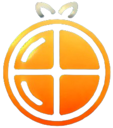

# Crack-Those-Macros
---
# About
---

---

## Team Members
- Caleb Jones | Github Id: CalebJonesXCIX
- Alexander Paredes | Github Id: aparedes0212
- Nicholas Dubauskas | Github Id: ndubausk
- Cole Dombrowski | Github Id: CDUTK
- David Batista | Github Id: dbat1sta

## General Overview
- A web application that assists users in achieving their nutritional goals by identifying food options at local restaurants and supermarkets that align with their specified macro-nutrient targets.
- The user can create an account, login and fill out a questionnaire with information such as height, weight, and fitness goals such as weight loss and muscle building. 

## How to run web application:
- Run Backend with the following command from the **backend directory**: *python server.py*
- Run Frontend with the following command from the **frontend directory**: *npm start*
- *Ensure all dependencies are installed*
  
### Note to the Professor:
- We implemented an Azure based SQL server, and have included the credentials within this repo. We aim to maintain this repository as private, and will be for educational purposes only.
- When attempting to launch the application for the first time: Please submit a call to the database, and allow a minute or two for the database to startup.
    - *Timeout errors are to be expected until the database has started up*
---
## License Information
- MIT License
## Dependencies
#### pip install
```
flask
dotenv
pyodbc
random
pandas
requests
```
#### npm install
```
axios
react
react-dom
react-router-dom
styled-components
html-react-parser
```
